# Small Form Factor PC Build Part 1
#### Jan 2, 2021
This article I originally [posted to the SSFPC subreddit](https://www.reddit.com/r/sffpc/comments/kpc0ul/part_1_of_my_first_sff_build_metalfish_s5_case/).

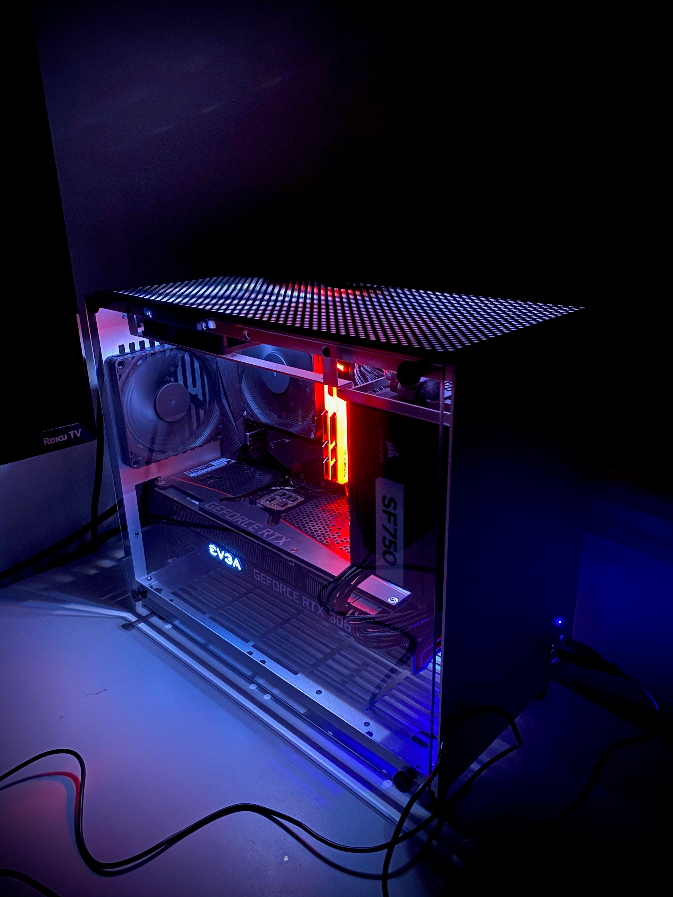

## Tl;dr
This is my first small form factor gaming PC. It uses a AMD Ryzen 7 5800X processor and EVGA RTX 3080 graphics card, all inside a small Metalfish S5 case purchased from Aliexpress.

This is partially a temporary setup so that I could get it running soon enough to play Cyberpunk 2077 when it releases. In the near-future I would like to add full custom water-cooling for the GPU and CPU.

I am calling this part 1 of my build. I wanted to get most of the major parts and get it running in time to play Cyberpunk 2077. Part 2 will be full custom water cooling for both the GPU and CPU.

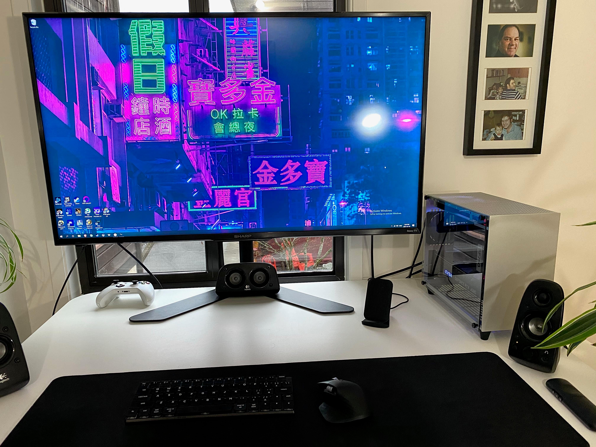

This is my first AMD PC and my first small form factor build. I downsized from a giant NZXT S340 case which my previous GTX 1080 / i5 6600k build from 2016 lived in.

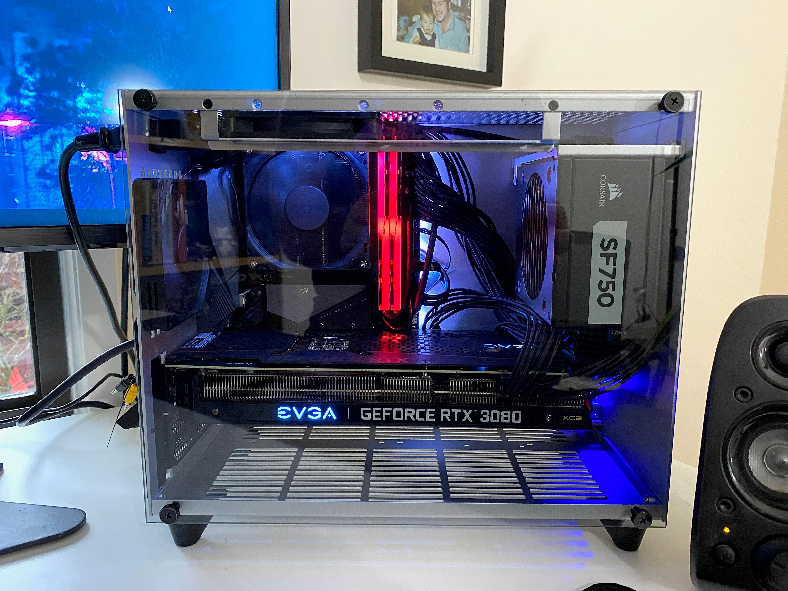

## Components
* • Metalfish S5 case from Aliexpress
* • EVGA RTX 3080 XC3 Ultra
* • Ryzen 7 5800X
* • Cooler Master G200P cooler
* • 2x Noctua NF-A9x14 fans (1 on CPU cooler, 1 exhaust on back panel)
* • Cooler Master slim RGB fan (came with the CPU cooler, on top panel as exhaust)
* • Gigabyte B550i Aorus Pro AX motherboard
* • 16GB TridentZ 3200MHz CL14 memory
* • 1TB XPG SX8200 Pro M.2 SSD
* • 250GB Samsung 850 Evo 2.5" SSD
* • Corsair SF750 power supply
* • Sharp 43" 4k 60Hz TV as my monitor
* • Nuphy low-profile mechanical keyboard with Kailh choc white switches
* • Logitech MX Master 3 mouse

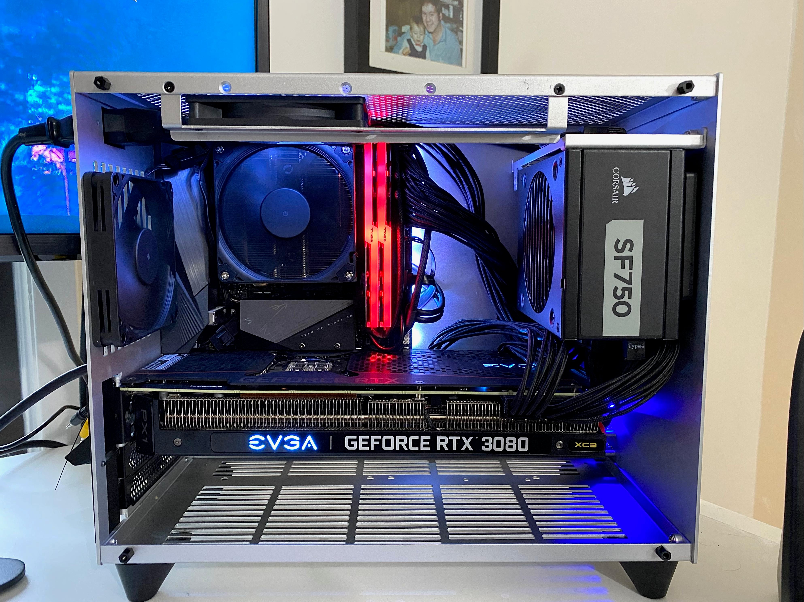

This first part of the build went together pretty simply. I tried to do some basic cable management. The front I/O I actually ran under the motherboard before screwing it down. There is essentially no cable management space in this case, that is it's biggest negative. The power cables that come with the SF750 are quite nice and reasonably short, so they tuck away to the side.

The slim Cooler Master cpu cooler I used was really just a temporary choice until I can complete my water cooling setup. I wanted a cooler that could fit in this case (<135mm tall) and AMD & Intel support so I can use it in my other PC builds. This cooler fit the bill and was in stock at my local [Memory Express](https://www.memoryexpress.com/). It let me get up and running with this CPU in time to play Cyberpunk 2077!

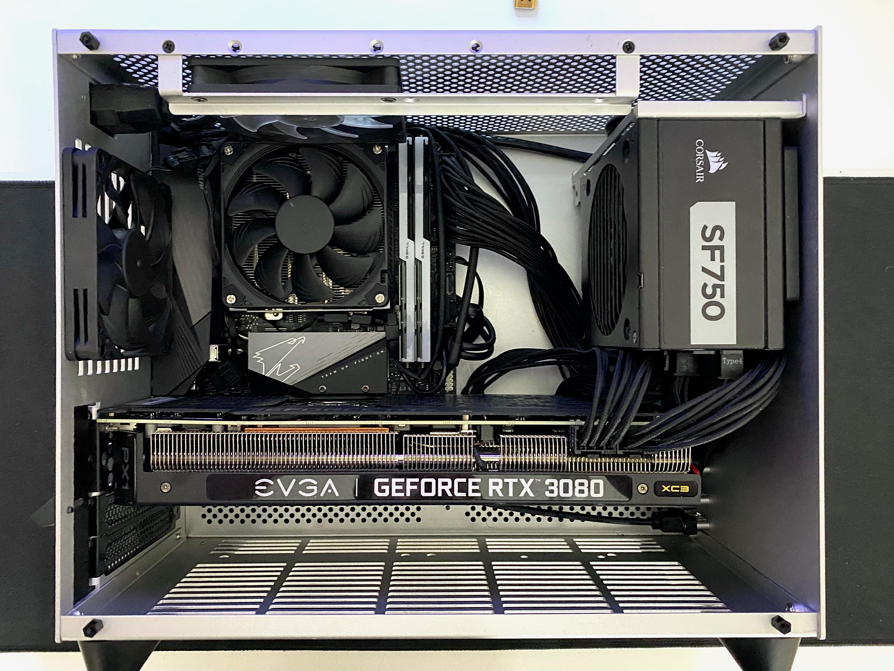

I do not recommend this cooler for the 5800X, it's obviouslly not enough. The system idles around 55c and very quickly spikes to >90c and throttles when doing anything processor intensive. I put those 2 exhaust fans near it to try to get the hot air out of there as much as possible. I even added stand-off spacers to the glass side panel to add a gap to allow more air intake. This was a good enough solution for me to play games but running close to 90c isn't great for the longevity of the processor. This is only meant to be a temporary solution.

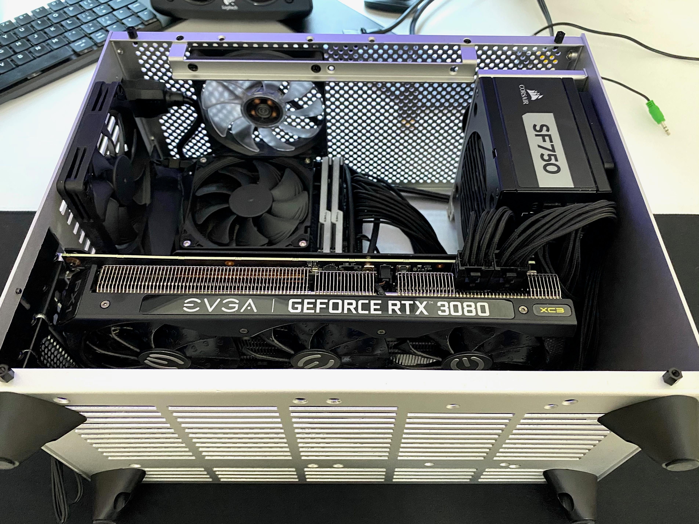

The RTX 3080 actually runs quite well in this case with the stock EVGA XC3 cooler. It levels out under 75c while gaming but the fans run pretty fast (80-100%). It is just pulling air through the bottom of the case with its own fans.

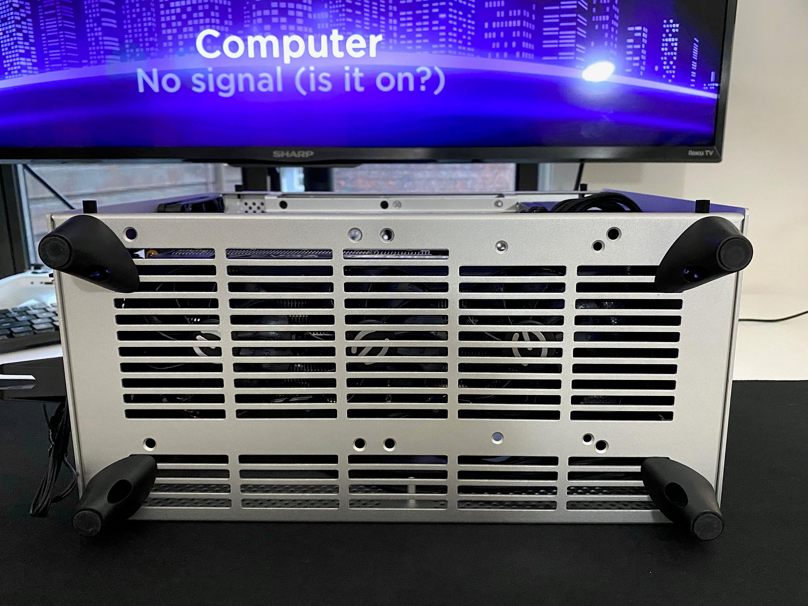

I also changed the feet on the case. These ones I took from my Logitech subwoofer. They raise the case a bit higher to allow a bit more airflow from the bottom. The feet it came with were quite shallow. I also prefer the matte black over the chrome of the standard feet.

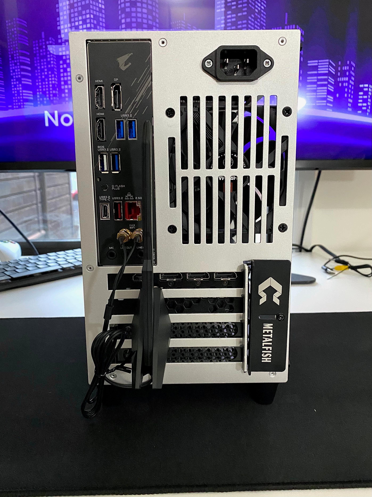

Here are some basic performance numbers, this obviously isn't a thorough review of the components. I have been running Cyberpunk 2077 at 4k with Ultra settings, DLSS at the Quality preset, and ray-tracing reflections only. It runs around 45-50 fps. Turning off ray-traced reflections it will sit close to a steady 60 fps. Microsoft Flight Simulator gets around 50fps with 4k Ultra settings. Other games I am playing are a bit older and run higher than 60fps which is perfect for my 60Hz monitor. These include World of Warcraft, Elite Dangerous, Cities Skylines, Project Cars 2, and Forza Horizon 4.

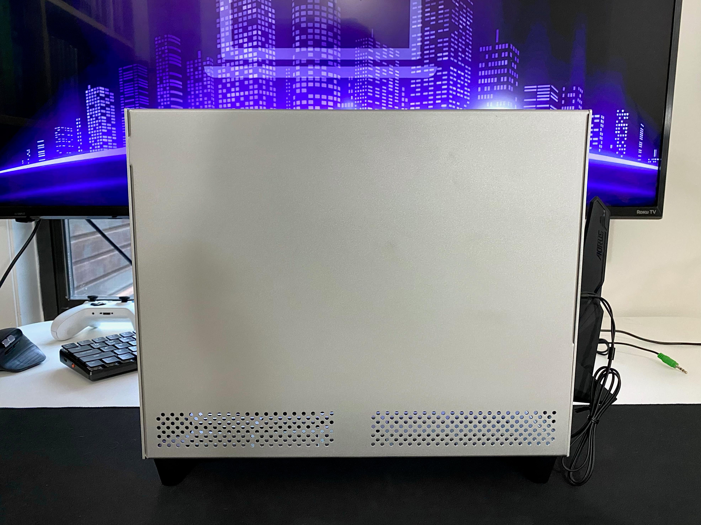

The end goal for this PC is a full custom water-cooling loop. I have on order the Barrow CPU block/pump/resivoir combo unit from Aliexpress along with Barrow fittings. I have an EK waterblock & backplate for the RTX 3080, an EK SE240 radiator that will live at the bottom of the case, and EK soft black tubing. I will run 2x Noctua NF-A12x15 slim fans on the radiator as intake.

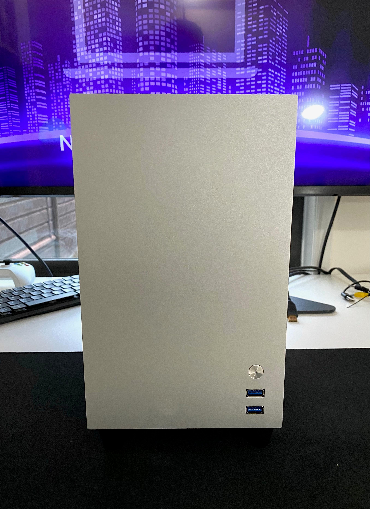

This will hopefully get my CPU temperature under control and allow for some overclocking headroom.

I may end up doing some more upgrades to the loop eventually if I find the 240mm radiator isn't sufficient to cool both the CPU and GPU.

I am not 100% sure about this LED colour scheme I found. I was sorta going for the HUD blue/red from Cyberpunk 2077 but it still needs a little tweaking.

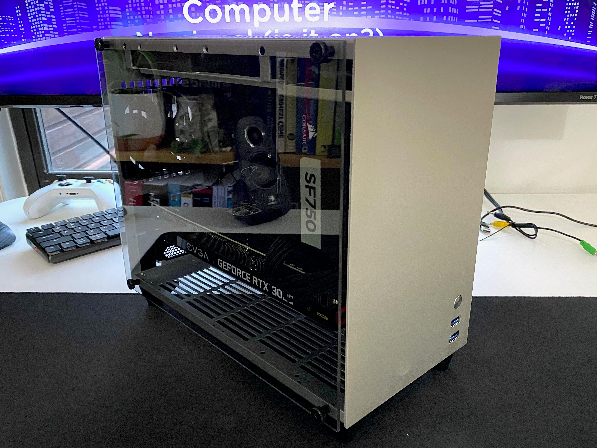

If you have any questions about the current components let me know! I'll do a follow-up post when my watercooling is complete.